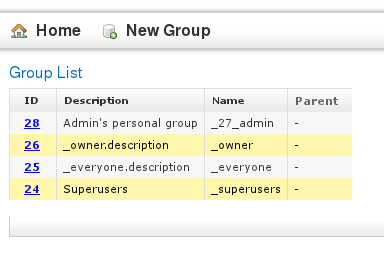

# Groups

## User groups in the Cinnamon CMS

User accounts are organized in groups - and each user has at least one group, his "personal group". A group may be associated with ACLs, forming an ACL-entry.

There are three special groups which have to be present in a Cinnamon repository:

* *_everyone*
    Every user is automatically a member of this group. You can create ACL-entries with this group to grant certain rights to all users.

* *_owner*
    During permission validation a user is considered to be a member of the owner group, if he is the owner of this object. This way you can deny write-permission to all users but grant it to the owner of an object.
    Note: the creator of an object is also its owner.

* *_superuser*
    The members of this group are not limited by permissions or ACLs in any way - they simply are not subject to permission checks. Do not add users to this group because it's the easy thing to do. Rather, you may create a more permissive default ACL, if you really wish to avoid a proper rights management.

 
## Advise for group management

*    The special groups are computed automatically, it is not recommended to add real user accounts to these groups.
*    Do not delete a user's personal group.
*    Do not rename a user's personal group.
*    Although it is possible to assign a group to another (and create group hierarchies in this way), it is better to not create unnecessarily complex inheritance hierarchies to which a user's group is directly added. So, instead of having all editors inherit the group "editors", you should make them members of the group "editors". This makes it easier for example if you have to transfer one user from "editors" to "reviewers" - or if he has to be in both groups at once.

 
