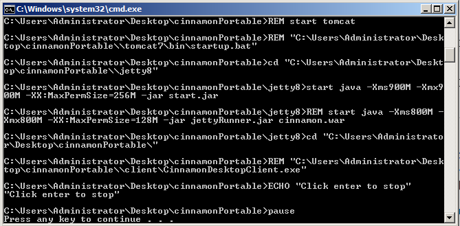
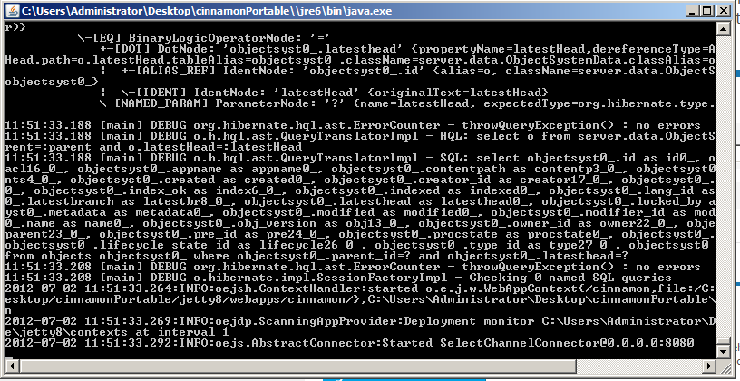
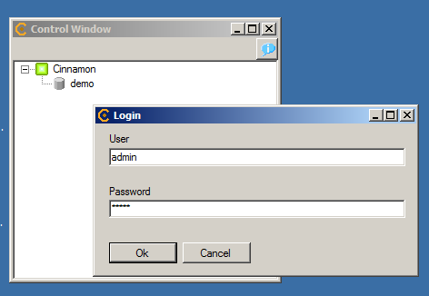
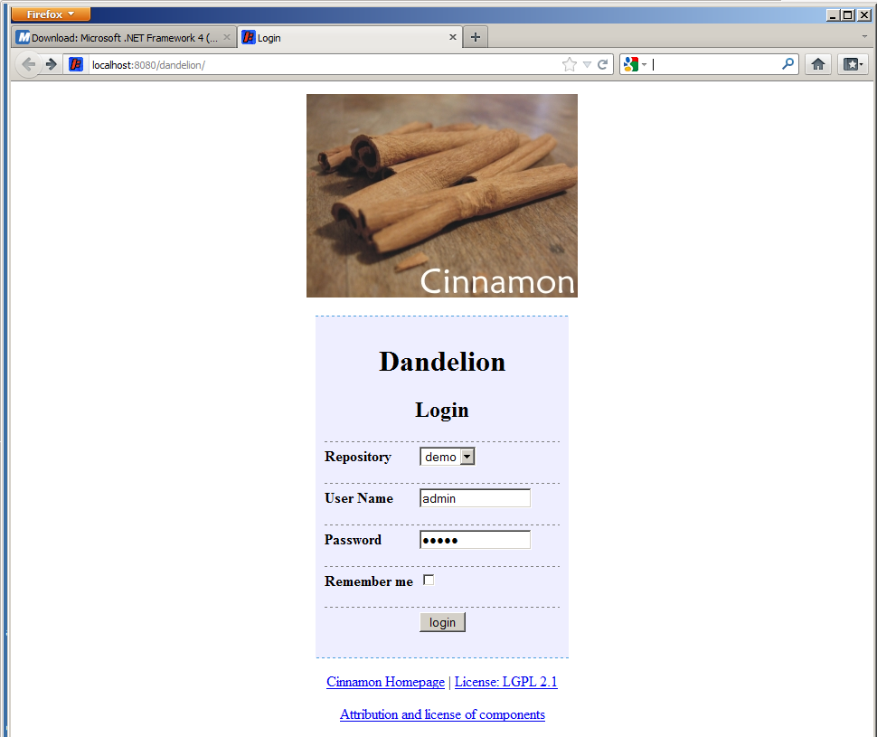

# Cinnamon - Portable edition

This is the standalone version of Cinnamon, which includes everything needed 
to run Cinnamon (both the server and the client) in one big zip archive. 

You should use this version if you just want to try and see what Cinnamon has to offer. It is not intended for production purposes and has some technical limitations (due to the scripted environment - in all other regards, this version is feature complete).

## Requirements

This version was tested on Windows Server 2008 64 Bit. It should run on all modern Windows systems (32/64 Bit) - if you encounter problems, please contact us so we can improve your Cinnamon experience.

* You will need about 1 GByte of RAM.
* Port 8080 on your machine must be available.
* You must have .NET Framework 4.0 installed [download for free from Microsoft](http://www.microsoft.com/en-us/download/details.aspx?id=17718)
* In "My Documents" create a folder 'cinnamon' with a sub folder 'checkout'. (The client expects this to exist).

## start the server

Double click on cinnamon.bat. Two windows will open, a command line window with some script output, and a java.exe window with incredible amounts of log messages. Even on a fast machine, this may take a minute or two.

## start the client

* Open the folder "client" and double click on "CinnamonDesktopClient.exe".
* The repository list should show a green lighted Cinnamon server with a demo repository. Right-click on "demo" and log on as user admin with password 'admin'.

 
 
* Right-click on the admin user, choose "repository navigation" and you will see the repository window.

## Administration

Go to (http://127.0.0.1:8080/dandelion) to use Dandelion, the administration tool.

## stop the server

After testing, stop the server by selecting the java window and pressing CTRL-C.
It's possible that the process does not shut down cleanly - sorry, that seems to be the only annoying problem remaining... you may have to terminate the Java process via the task manager (or have a 500 MByte huge mean Java-process hanging around in the background, scaring other programs and blocking your 8080 port until shutdown).

## stop the database

Select the cmd.exe window and press any key. The database should now shut down. If it takes too long, just close the window...

# Using DITA

The Cinnamon portable edition comes with the current DITA Open Toolkit, but is not yet properly configured to use this, as the batch command script used to start the server does not play well with the environment variables needed by the toolkit. You can check out the demo DITA files in the repository and edit them with your DITA aware editor, though. Just remember that to get the full integration, you will have to either properly install Cinnamon or try to follow the instructions in client/docs/CinnamonInstallationAdministration.en.pdf.

# License Information

This portable install uses:

* [Java 6 Runtime from Oracle](http://www.oracle.com/technetwork/java/javase/downloads/index.html)
* [Jetty 8](http://www.eclipse.org/jetty/about.php)
* [Postgres 9](http://www.postgresql.org/)
* [Cinnamon 2.2.2](http://cinnamon-cms.de)
* [DITA 1.5.4](http://dita-ot.sourceforge.net/)

All of which are software projects available for free under their respective licenses.

## Support

If you need further support, for example

* migration of legacy data
* configuration of search indexes
* advise on how to integrate other technical documentation formats like SGML, Framemaker and S1000D
* audit trails in Cinnamon and permission management
* hosting and virtualization of Cinnamon server instances
* configuration of DITA output

please contact the company which provides Cinnamon: [Horner GmbH](http://horner-project.de).

For installation support,  comments and feedback please mail: ingo.wiarda@horner-project.eu (Cinnamon server maintainer)
