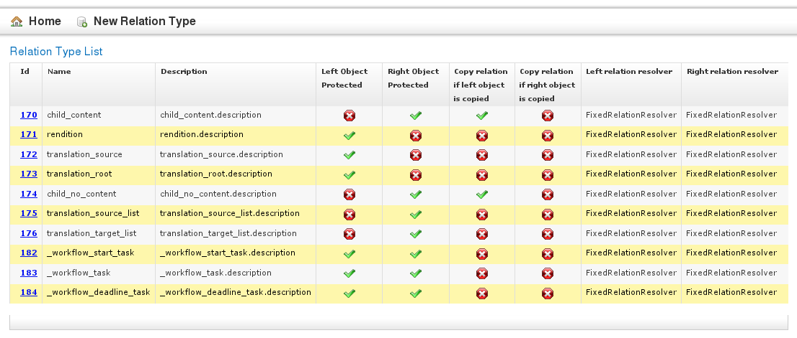

# Relations and Relation Types
## What are relations?
Relations are used to define a link between two objects. For example, an HTML document 
may contain several images which are required for display. Cinnamon detects this dependency
and creates a relation between the document and the image object in the repository. Of course,
you can create relations between arbitrary objects manually if needed.

## Relation Type flags
Relations have two objects, described as having two sides, which are called "left" and "right", 
and by choosing a relation type you can define how the systems responds to changes made to
one or both objects. The following options may be set by the relation type:

1. "left object protected": the object on the left side cannot be deleted as long as the relation exists. For example,
  this prevents a user from deleting an image that is required by a document.
2. "right object protected": the object on the right side cannot be deleted as long as the relation exists.
3. "copy relation if left object is copied": if this flag is set, the relation will be copied if the user creates another version (or copy) of the left object.
  In regard to the document/image example, if the user copies the HTML document, the new document will also contain the relations
  to the images referenced by the original. 

## Relation Resolvers
A Relation Type also has to define a relation resolver for both the left and the right side of the relation.
This allows you to use dynamic relations which not always resolve to the same object. There are three default
relation resolvers:

1. FixedRelationResolver
2. LatestHeadResolver
3. LatestBranchResolver

For an example, lets look at a DITA document (a repair manual) which references an image of a car's engine. 
The manual's author has defined a relation between the manual (left side) and the engine's image (right side of relation), 
and the right relation resolver is set to the default, FixedRelationResolver.
If the product photographer creates a new, improved version of the engine and stores it as version 2, the manual object
will still point to version 1 of the image, as the relation is fixed. This is generally a good thing, as when a customer
requires a handbook for an older version of a machine, you cannot simply give him the latest version with images that depict a
totally changed and reworked machine.

But what happens if you always need the newest photo of the engine, like for a product catalog or web shop? You
are not going to offer your customers the old machines anyway, so it would be good if the catalog only included
up-to-date images. In this case, the Latest Head Resolver will be used on the right (image) side of the relation: if
the catalog object is requested by the client, the image will be resolved to the latest version.

If you have a manual for machine version 1, version 2 and 3, and the repair instructions of version 2 have to be updated,
you will need the latest version of the image, too - but for this very machine build, not for the latest. In that
case you can use the LatestBranchResolver, which will resolve the image to version 2-1.1 (version 2, branch 2, sub-version 1)
instead of 3.

