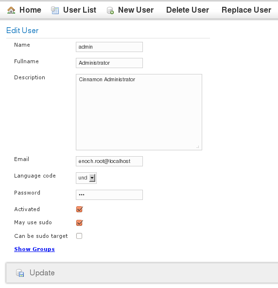
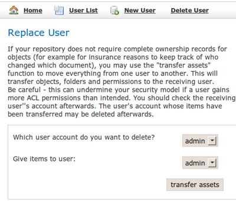
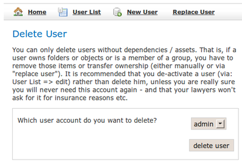

# User accounts in Cinnamon

## What are user accounts used for?

### Ownership of objects
To keep track of which user created an object or made the last modification to it,
Cinnamon stores the creator, owner of each object  (and each version of it), along with 
the most recent user who modified it. The date/time of creation and modification are also stored.

Folders only have owners, so they are not tracked with the same level of detail,
but up to now this has proved to be sufficient. If you need further logging and more
specific metadata (for example "list of all changes made to files inside this folder"),
a Change Trigger can be programmed to store this kind of custom metadata.

### Authentification
With the exception of retrieving the list of available repositories, 
all API methods of the Cinnamon server require some kind of authentication by the client. 
A user has to connect to the server with a valid combination of login name and password to receive a session ticket. 
This ticket is then used on all subsequent actions by this client (until it expires or the client disconnects).

### Authorization
A user may be a member of one or more groups, and whenever he wants to access
or modify content on the repository, the triple combination of {group, acl, permissions} is
checked to see if he actually is authorized to do this.

## Model
A user account object has the following fields:

* Name (== login name)
* Full name
* Description (of role or position in the customer's company)
* Password (may be stored encrypted or unencrypted)
* Email
* A boolean flag if the account is activated or not. A new account is always activated.
* Sudoer: this user may impersonate other users. This is intended for automatic processes which act
  on behalf of a user and create / modify objects for him.
* is sudoable: if this flag is set, a user may be the target of the sudo API call. Some user accounts
  should not be made sudoable, for example superusers, since this would pose a security risk.

 

## Deactivating and Deleting users
Under normal circumstances, Users can be deactivated, but not deleted 
as this may leave objects orphaned without a valid owner or creator.  

If the configuration allows it, users may be replaced before a complete deletion. 
This way all objects depending on this account will be removed or transferred.
The administration tool offers a useful form for this very purpose:

This will transfer all assets from one user to another. Afterwards, the user can be deleted:

